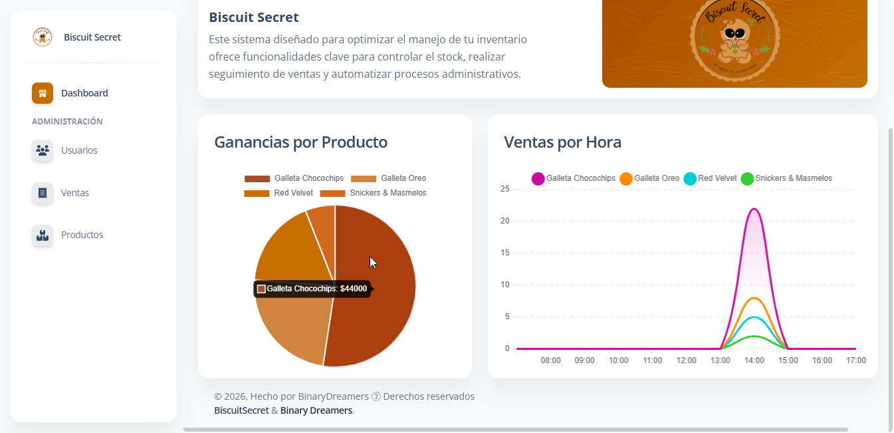
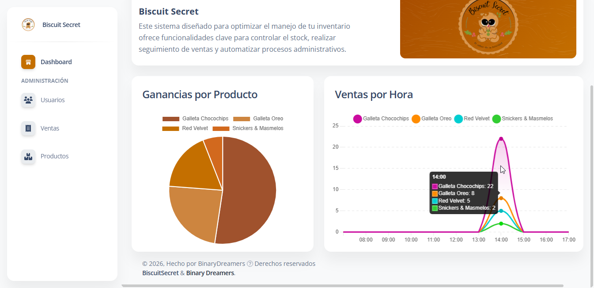
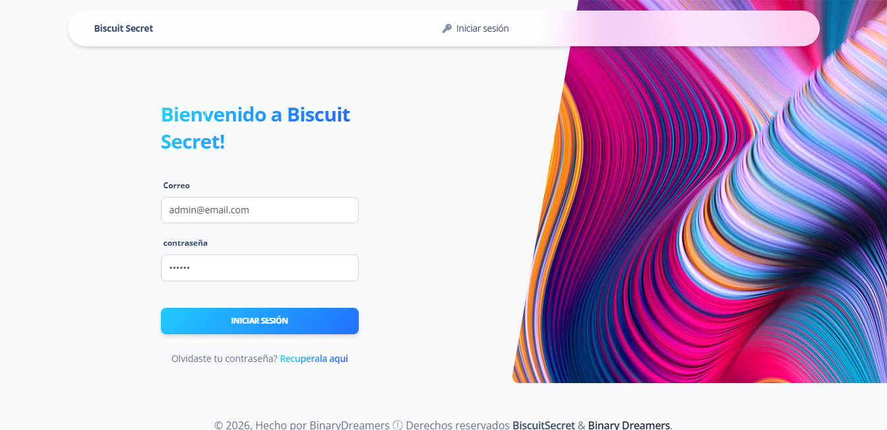
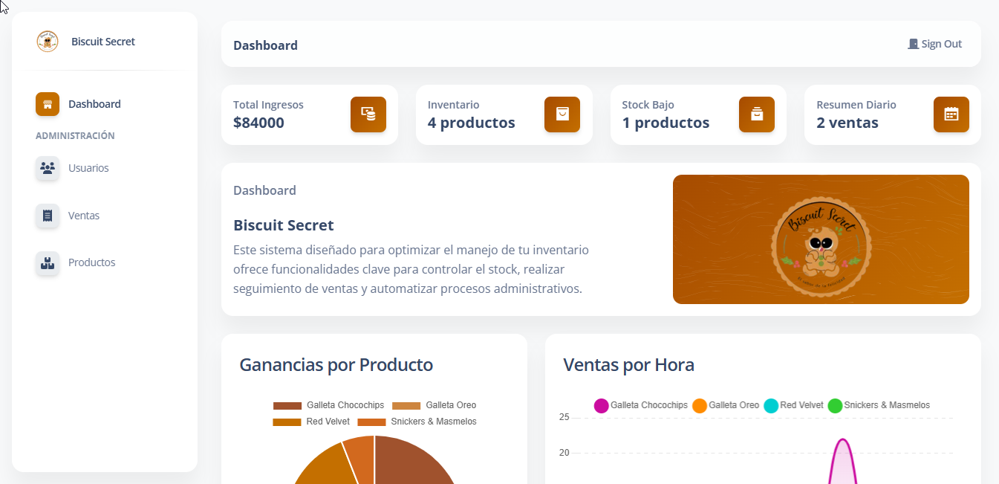
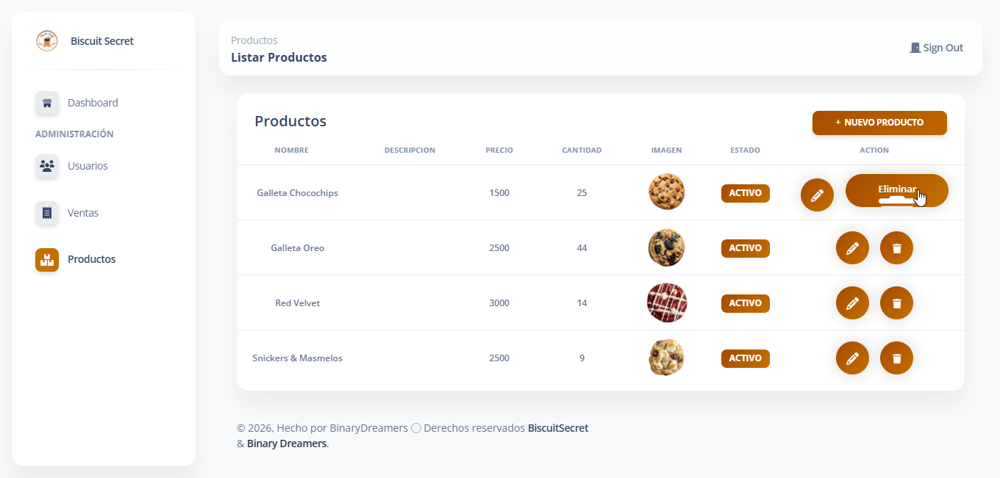
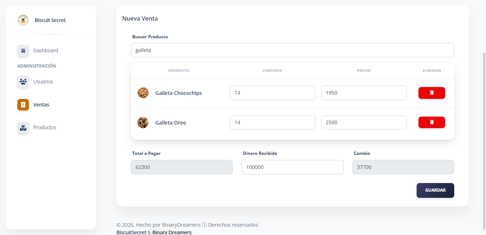
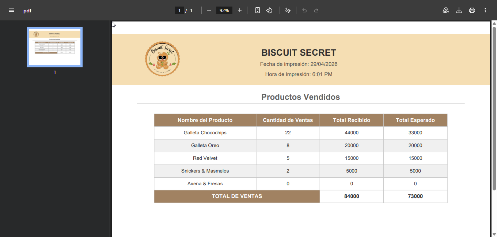

# Biscuit Secret — Sistema de Gestión 

Sistema de gestión desarrollado en Laravel para administrar un negocio de galletas. Permite gestionar productos, ventas y usuarios de manera eficiente y segura.

---

## Contenidos

- [Vista General](#vista-general)
- [Módulos del Sistema](#módulos-del-sistema)
- [Equipo](#equipo)
- [Tecnologías](#tecnologías)
- [Instalación con Docker](#instalación-con-docker)

---

## Vista General

### Dashboard Principal

<div align="center">
  
  &nbsp;
  
</div>

---

## Módulos del Sistema

### Inicio de Sesión

Acceso al sistema mediante correo y contraseña. Solo los usuarios registrados pueden ingresar al panel de administración.

<div align="center">
  
</div>

---

### Dashboard

Vista general del negocio en tiempo real. Muestra métricas clave como total de ventas, ingresos del día y gráficas de ganancias y ventas por hora, permitiendo tomar decisiones rápidas sin necesidad de navegar entre módulos.

<div align="center">
  
</div>

---

### Gestión de Productos

Catálogo completo del inventario. Permite registrar productos con nombre, descripción, precio, stock e imagen. Los productos pueden editarse, desactivarse y se muestran paginados ordenando siempre los activos primero.

<div align="center">
  
</div>

---

### Gestión de Ventas

Registro de pedidos con múltiples productos en una sola transacción. El sistema valida el stock disponible en tiempo real, calcula subtotales y el total automáticamente, y descuenta las unidades vendidas del inventario al confirmar. Las ventas pueden cancelarse restaurando el stock original.

<div align="center">
  
</div>

---

### Reporte de Ventas

Genera un reporte en PDF con el detalle de productos vendidos: cantidad de ventas, total recibido y total esperado por producto, con fila de totales al final. El archivo se descarga directamente desde el navegador con fecha y hora de impresión incluidas.

<div align="center">
  
</div>

---

## Equipo

| Rol | Nombre | GitHub |
|-----|--------|--------|
| **Scrum Master** | Camilo Vanegaz *(Instructor SENA)* | — |
| **Development Leader** | Nicolas Morales | [](https://github.com/NicolasMoralesC10) |
| **Team** | Sean Paul Moreno | [](https://github.com/Paul4357) |
| **Team** | Juan Esteban Gonzalez | [](https://github.com/JuanesGonzalez17) |

---

## Tecnologías

| Tecnología | Versión |
|------------|---------|
| PHP | 8.2 |
| Laravel | 11.44+ |
| MySQL | 8.0 |
| Docker | 20.10+ |

---

## Instalación con Docker

> **Requisito:** Tener Docker instalado. Si no lo tenés, descargalo en [docker.com/get-started](https://www.docker.com/get-started/) — es gratuito e incluye todo lo necesario.

### 1. Clonar el repositorio

```bash
git clone https://github.com/NicolasMoralesC10/biscuit-secret.git
cd biscuit-secret
```

### 2. Levantar los contenedores

```bash
docker compose up --build -d
```

Esto construye la imagen e inicia dos servicios automáticamente:
- **app** — Laravel + Apache en `http://localhost:8080`
- **mysql** — Base de datos MySQL en el puerto `3306`

> La primera vez tarda unos minutos porque descarga las imágenes de Docker.

### 3. Listo

Abrí `http://localhost:8080` en tu navegador.

Credenciales por defecto:

| Campo | Valor |
|-------|-------|
| Email | `admin@biscuit.com` |
| Contraseña | `secret` |

### Conectar tu cliente MySQL (opcional)

Si querés explorar la base de datos con DBeaver, TablePlus u otro cliente:

| Campo | Valor |
|-------|-------|
| Host | `127.0.0.1` |
| Puerto | `3306` |
| Usuario | `biscuit` |
| Contraseña | `biscuit` |
| Base de datos | `BiscuitSecret` |

### Comandos útiles

```bash
# Ver logs en tiempo real
docker compose logs -f app

# Detener los contenedores
docker compose down

# Detener y borrar la base de datos
docker compose down -v
```
